<!--
  Profile README for github.com/tushar-sharma001/tushar-sharma001
  Widths 370/490 keep the portrait and info card the same height --
  re-match these if you ever bump H in scripts/make_info_card.py.
-->

<table>
<tr>
<td valign="top"></td>
<td valign="top"></td>
</tr>
</table>

## Tushar Sharma

**Data Science · Machine Learning · Generative AI** — BCA @ GGSIPU

 

<!-- animated contribution graph, refreshed daily by the workflow -->

 

### 💼 Experience

- **AI Intern** · Infosys · *Oct 2025 – Dec 2025* — built ML pipelines on 10k+ records, lifted prediction accuracy 18%
- **AI & Prompt Engineering Intern** · Edunet Foundation · *Jul – Aug 2025* — 100+ prompts tuned, +25% response relevance
- **AWS AI & ML Scholar '26** · Amazon Web Services · *Apr – Jun 2026*
- **McKinsey Forward Alumni** · McKinsey.org · *Apr – Jun 2026*
- **Campus Mantri → Campus Ambassador** · GeeksforGeeks · *Jan 2026 – Present*
- **Student Ambassador** · Google Student Ambassadors (India) · *May 2026 – Present*

More roles & open-source contributions

 

- **AI & Prompt Engineering Intern** · VaultofCodes · *Jun 2025*
- **Campus Ambassador** · Unstop · *Nov 2025 – Apr 2026*
- **Alumni** · Aspire Institute (Cambridge, MA) · *Aug 2025 – Jan 2026*
- **Campus Partner** · Perplexity · *Sep – Nov 2025*
- **Event Management & Planning Team Lead** · DevSphereIndia · *Sep – Nov 2025*
- **Technical Research Contributor** · SevyDevy · *May 2026 – Present*
- **Open Source Contributor** · SWOC '26 · SSOC '25/'26 · GSSoC '24

### 🚀 Projects

**Customer Churn Prediction System**
Random Forest + Logistic Regression on 7,000+ customer records, 91% classification accuracy, interactive Streamlit dashboard.
`Python` `Scikit-learn` `Pandas` `Streamlit`

**PolicySense AI — Policy Analysis & Recommendation Engine**
NLP pipeline summarizing 1,000+ government policy documents with 88% recommendation relevance accuracy.
`Python` `NLP` `Generative AI` `Scikit-learn`

**AadhaarPulse — District-Level Adoption Intelligence**
ETL + statistical analysis across 700+ districts and 50,000+ records to surface regional adoption gaps.
`Python` `Data Analytics` `Streamlit`

### 📜 Certifications

Artificial Intelligence Primer · Principles of Generative AI · Generative Models for Developers *(Infosys)* — Prompt Design in Vertex AI · Build Real-World AI Apps with Gemini & Imagen *(Google Cloud Skill Badges)* — Stanford Code in Place 2025 — AWS AI Practitioner Challenge

### 🛠️ Tech Stack

                    

